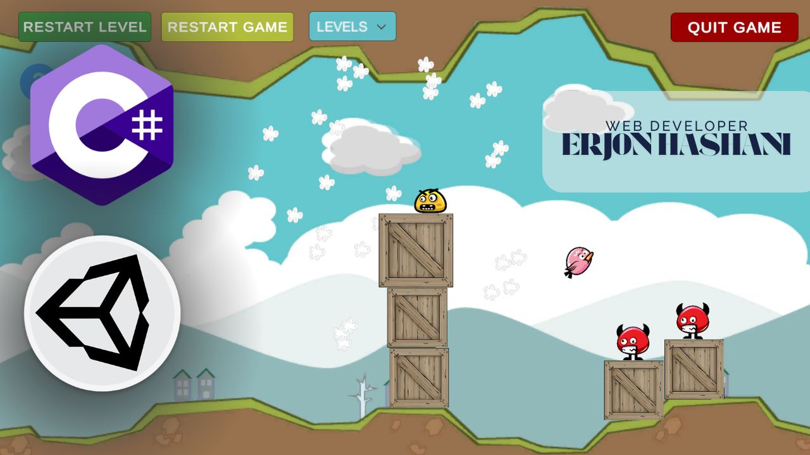

# Bird Game - Project Documentation

**Project:** Bird Game  
**Course:** Game Development – 2025, Semester 6  
**Student:** Erjon Hashani  
**University:** University of Business and Technology - UBT 
**Faculty:** Computer Science and Engineering

---

---

## Game Description
Bird Game is a 2D level-based game where the player controls a bird by dragging it with the mouse (or finger on touchscreens) and releasing it to hit enemies (monsters). Inspired by **Angry Birds**, the goal is to eliminate all enemies to progress to the next level.

The bird moves based on the direction and strength of the player's drag, with a visual LineRenderer effect. When the bird hits enemies, they disappear in a “poof” effect.

---

## Key Features
- 5 interconnected levels with progressive difficulty.  
- 4 different types of enemies for visual variety.  
- Functional UI buttons:  
  - **Restart Level** – restart the current level  
  - **Restart Game** – return to the first level  
  - **Levels** – dropdown menu to select a specific level  
  - **Quit Game** – exit the game  
- Victory screen after completing the final level.  
- Visual effects when enemies are eliminated.  
- Automatic return to level 1 after winning the last level.  

---

## How to Play
- Click on the bird and drag it back (on the left side) to launch.  
- Release to hit the enemies.  
- Eliminate all enemies to progress to the next level.  
- The level restarts automatically if the bird leaves the play area or remains idle for more than 3 seconds.  

---

## Technologies Used
- **Unity Engine:** 6 (v.6000.0.42f1)  
- **Programming Language:** C#  
- **Project Structure:** Scenes (Levels), Prefabs, and separated scripts  
- **Physics:** Physics2D and Collision Detection  
- **UI:** Canvas and Event System  

---

## Main Project Structure
- **Assets/Scripts/**  
  - `Bird.cs` – controls bird movement and interaction  
  - `Enemy.cs` – handles enemy destruction on contact  
  - `GameButtons.cs` – UI button functionality  
  - `LevelController.cs` – level progression logic  
  - `LevelSelector.cs` – manual level selection from dropdown  
- **Assets/Prefabs/** – e.g., “poof” cloud particles prefab  
- **Assets/Scenes/** – levels (Level1, Level2, … Level5)  
- **Assets/TextMeshPro/** – advanced text rendering in UI  

---

## Video Demo
The video includes:  
- Demonstration of the game and main features  

---

## Author
**Name:** Erjon Hashani  
**Email:** erjonndev@gmail.com 
**Course:** Game Development – 2025  

© All rights reserved for educational purposes.
